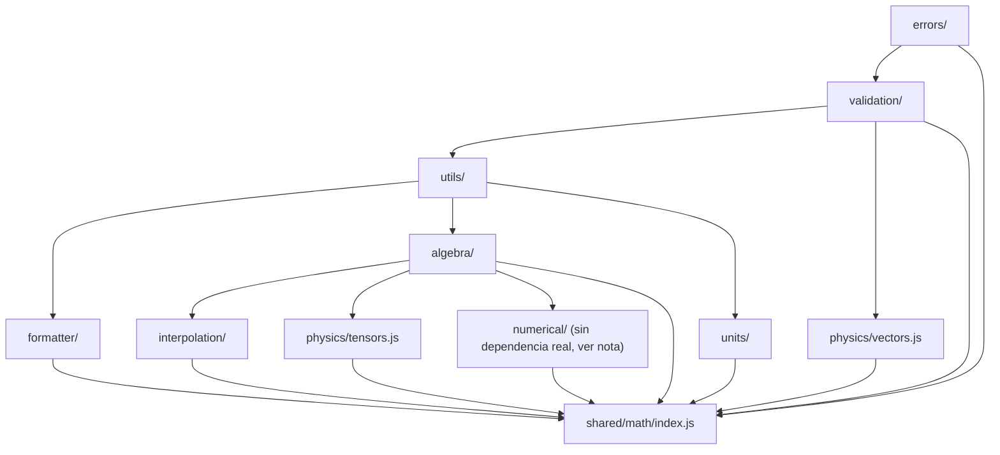

# Architecture.md — CalculadorasIngenieria

## 1. Filosofía del proyecto

CalculadorasIngenieria va a crecer durante varios años y va a terminar
teniendo decenas de calculadoras: álgebra, matemática, física,
aeronáutica, química, electrónica, motores, ECU, propulsión, estructuras,
métodos numéricos. Si cada calculadora implementara sus propios
algoritmos, el proyecto acumularía N implementaciones distintas (y
probablemente inconsistentes) de "resolver un sistema lineal" o
"interpolar una tabla" — cada una con sus propios bugs, su propia
precisión numérica, su propio criterio de redondeo.

La decisión de fondo de este proyecto es la contraria: **existe un único
motor matemático** (`shared/math/`), y **ninguna calculadora implementa
un algoritmo propio**. Toda calculadora es, en esencia, una interfaz
(HTML/CSS/JS) que junta datos del usuario, se los pasa al motor, y
muestra lo que el motor devuelve. Si dos calculadoras necesitan resolver
un sistema lineal, las dos llaman a la misma función (`solveSystem`) del
mismo módulo, con el mismo comportamiento, los mismos casos límite
resueltos una sola vez y las mismas excepciones.

Esto tiene consecuencias concretas de diseño:

- El motor es una **biblioteca matemática pura**: no conoce el DOM, no
  genera HTML, no tiene estilos. Se podría, en teoría, correr en Node,
  en un Web Worker, o en el navegador, sin cambiar una línea.
- El motor **no sabe que existen calculadoras**. No hay ningún archivo
  en `shared/math/` que mencione "álgebra", "física" o "aeronáutica"
  como *producto*; esos son dominios de la interfaz, no del motor (el
  motor sí tiene una carpeta `physics/`, pero es porque ahí viven
  operaciones vectoriales/tensoriales genéricas, no porque conozca la
  existencia de una calculadora de física).
- Cualquier corrección de un algoritmo (por ejemplo, un ajuste en la
  tolerancia numérica de Gauss) se hace **una vez**, en un lugar, y
  beneficia a todas las calculadoras que ya existan o que se creen
  después.

## 2. Arquitectura modular

`shared/math/` está organizado en capas. Cada capa solo puede depender
de capas iguales o inferiores; nunca al revés. Esto es lo que en la
práctica evita que el motor se vuelva una maraña de imports cruzados a
medida que crezca durante los próximos años.

```
Capa 0  errors/         Clases de excepción. No depende de nada.
Capa 1  validation/     Validación de números y de forma matricial/vectorial.
                        Depende solo de errors/.
Capa 2  utils/          Constantes y helpers genéricos (incluida la
                        fábrica de conversores de unidades). Depende de
                        validation/ y errors/.
Capa 3  formatter/      Precisión numérica y formato para mostrar en
                        pantalla. Depende de validation/ y utils/.
Capa 4  algebra/        Matrix y todos los algoritmos matriciales.
        interpolation/  Depende de algebra/ (spline.js reutiliza gauss.js).
        numerical/      Independiente de algebra/ (raíces e integración
                        operan sobre funciones, no sobre matrices).
        physics/        vectors.js es independiente de algebra/ (ver
                        justificación en la sección 5). tensors.js sí
                        depende de algebra/ (Matrix + eigen.js).
        units/          Independiente de algebra/; solo depende de
                        utils/ (createUnitConverter), validation/ y errors/.
Capa 5  shared/math/index.js   Punto único de entrada: reexporta todo lo
                        anterior. Es la única capa que conoce la
                        totalidad del motor.
```

Ninguna capa importa "hacia arriba". `errors/` no sabe que existe
`algebra/`; `algebra/` no sabe que existe `shared/math/index.js`. Esto es
lo que permite reorganizar el interior del motor en el futuro sin romper
nada: mientras `index.js` siga exportando los mismos nombres, a la
interfaz no le importa dónde vive el archivo real.

### Estructura de carpetas

```
shared/math/
├── index.js              Punto único de entrada (ver sección 6)
├── algebra/               Matrix, Gauss, determinante, inversa, LU, QR,
│                          Cholesky, autovalores/autovectores
├── interpolation/         Lineal, Lagrange, splines cúbicos
├── numerical/             Newton-Raphson, bisección, secante, integración
├── physics/               Vectores y tensores
├── units/                 Conversión de unidades, con dispatcher (index.js)
├── formatter/             Precisión numérica y formato de salida
├── validation/            Validación de números y de matrices/vectores
├── errors/                Clases de excepción propias
└── utils/                 Constantes y helpers genéricos
```

## 3. Separación entre interfaz y motor matemático

El motor (`shared/math/`) y la interfaz (todavía no construida) son dos
mundos que se comunican por un único punto de contacto: `index.js`.

| | Motor (`shared/math/`) | Interfaz (futura) |
|---|---|---|
| Lenguaje | JavaScript puro | HTML5 + CSS3 + JavaScript |
| Conoce el DOM | No, nunca | Sí |
| Contiene HTML/CSS | No, nunca | Sí |
| Estado | Sin estado (funciones puras / clases inmutables en su uso) | Con estado (inputs del usuario, historial, tema) |
| Sabe qué es una "calculadora" | No | Sí |
| Cómo se importa | `import {...} from ".../shared/math/index.js"` | — |

Esta separación es también lo que hace verificable al motor de forma
aislada: toda la batería de pruebas que acompañó este proyecto (ver
`Roadmap.md`, control de calidad) corre en Node, sin navegador, sin DOM,
precisamente porque el motor no depende de ninguno de los dos.

## 4. Flujo de datos

Flujo normal (caso de éxito):

```
Usuario completa un formulario en la interfaz
        │
        ▼
La interfaz arma los datos (arreglos, números) y opcionalmente
los valida con las funciones de validación reexportadas
(assertFiniteNumber, assertSquareMatrix, ...)
        │
        ▼
La interfaz llama a UNA función del motor vía shared/math/index.js
(ej: inverse(matrix), convert(value, from, to), newtonRaphson(f, x0))
        │
        ▼
El motor calcula y devuelve un resultado (número, Matrix, u objeto
con { value, steps } / { root, iterations, history } / etc.)
        │
        ▼
La interfaz formatea el resultado para mostrarlo (formatNumber,
formatMatrix) y lo renderiza
```

Flujo de error (caso excepcional):

```
El motor detecta una condición inválida (matriz singular, sistema
incompatible con lo pedido, unidad desconocida, no convergencia...)
        │
        ▼
Lanza una instancia de MathError / DimensionError / SingularMatrixError
/ InterpolationError, con `message`, `code` y `context`
        │
        ▼
La interfaz captura el error (try/catch) y decide qué mostrar,
normalmente usando `error.code` (estable) en vez de parsear `error.message`
(pensado para mostrarse, puede cambiar de redacción con el tiempo)
```

El motor **nunca** decide cómo se ve un error en pantalla — solo informa
qué pasó, con la mayor precisión posible. Ese es un problema de la
interfaz, no del motor (coherente con la separación de la sección 3).

## 5. Dependencia entre módulos



Dos decisiones de dependencia que vale la pena explicar, porque no son
obvias a primera vista:

**`interpolation/spline.js` depende de `algebra/gauss.js`.** El spline
cúbico natural requiere resolver un sistema tridiagonal para las
segundas derivadas en cada nodo. En vez de escribir un solver
tridiagonal (Thomas) aparte, `spline.js` arma ese sistema como una
`Matrix` densa y lo resuelve con `solveSystem`, el mismo que usa
cualquier otra parte del motor. Es un poco menos eficiente que un
solver especializado, pero para las tablas de decenas de filas que
maneja esta plataforma (no miles), la diferencia es irrelevante frente
al beneficio de no tener una segunda implementación de "resolver un
sistema lineal".

**`physics/vectors.js` NO depende de `algebra/matrix.js`, pero
`physics/tensors.js` sí.** Un vector físico de 2 o 3 componentes no
necesita la maquinaria de una `Matrix` completa (sería acoplar la capa
de física a la de álgebra para una operación elemental). Un tensor de
rango 2, en cambio, se beneficia genuinamente de reutilizar `Matrix`
(suma, resta, transposición ya existen) y `algebra/eigen.js` (valores y
direcciones principales son, matemáticamente, los autovalores y
autovectores del tensor). Por eso `tensors.js` sí importa de `algebra/`.

## 6. El punto único de entrada (`shared/math/index.js`)

Ninguna calculadora debe importar un archivo interno de `shared/math/`
directamente. Siempre:

```js
import { inverse, Matrix, convert, newtonRaphson } from "../../shared/math/index.js";
```

y nunca:

```js
// MAL: acopla la calculadora a la organización interna del motor
import { inverse } from "../../shared/math/algebra/inverse.js";
```

La razón es doble:

1. **Estabilidad del contrato.** Si en el futuro `algebra/inverse.js` se
   dividiera en dos archivos, o `determinant.js` cambiara de carpeta,
   ninguna calculadora debería enterarse. Solo `index.js` necesita
   actualizarse.
2. **Superficie pública explícita.** `index.js` es, por definición, la
   lista completa de todo lo que una calculadora puede usar. Si una
   función no está reexportada ahí, es porque es implementación interna
   (ver la cabecera de `index.js` y `docs/API.md` para el detalle
   completo de qué se considera público y qué no).

### Excepción deliberada: `vectors` y `tensors` van agrupados

El resto del motor se reexporta con nombres planos
(`determinantByGauss`, `luDecomposition`, `newtonRaphson`...). Las
funciones de `physics/vectors.js` y `physics/tensors.js` usan nombres
deliberadamente genéricos (`add`, `sum`, `scale`, `dot`, `cross`,
`symmetricPart`...) porque son las palabras naturales para esas
operaciones. Si se aplanaran junto con el resto, es razonable esperar
que un futuro módulo de aerodinámica o estructuras quisiera un `add` o
un `scale` con otro significado, y chocaría con este. Por eso se
reexportan agrupadas:

```js
import { vectors, tensors } from "../../shared/math/index.js";
vectors.add([1, 2], [3, 4]);
tensors.vonMisesStress(stressTensor);
```

## 7. Convenciones de código

- **Nombres de función**: verbo o sustantivo en camelCase, en inglés
  (`determinantByGauss`, `solveSystem`, `newtonRaphson`). Los mensajes de
  error y los comentarios están en español, coherente con el resto del
  proyecto.
- **JSDoc obligatorio** en toda función exportada: `@param`, `@returns`,
  `@throws` (cuando aplica) y al menos un `@example`.
- **Validación al principio de cada función pública**, usando
  `validation/numbers.js` o `validation/matrix.js`, nunca un chequeo
  manual repetido.
- **Excepciones propias siempre**: `MathError`, `DimensionError`,
  `SingularMatrixError` o `InterpolationError`. Nunca `throw` de un
  string ni de un `Error` genérico. Cada excepción lleva un `code`
  estable (`UPPER_SNAKE_CASE`) para que la interfaz pueda reaccionar sin
  parsear el mensaje.
- **Resultados "ricos" en vez de solo un número**, cuando tiene sentido
  mostrar el procedimiento: la mayoría de los algoritmos de `algebra/`
  devuelven `{ value, steps }` o similar, pensando en una futura
  interfaz que muestre el desarrollo paso a paso (ver `docs/Roadmap.md`,
  Versión 3).
- **Ver `docs/Algorithms.md`** para el detalle matemático de cada
  algoritmo y **`docs/API.md`** para la referencia completa función por
  función.
